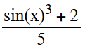

# Formula Ui

This library can read input strings like '(sin(x)^3+2)/5' and display the formula in pretty.

Supported operations are:

- Basic arithmetics (+-\\\*/)
- Trigonometric functions (sin, cos)
- Exponentiation ^

Output of '(sin(x)^3+2)/5' looks like this:

